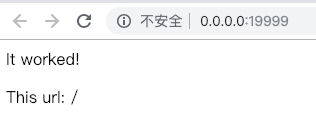

# Mug Skeleton 马克杯脚手架

基于bottle + peewee的web api框架

## 特性

* 要求Python 3.7
* 基于Bottle Web Framework
* 集成Peewee ORM，已带MySQL驱动
* 集成Cache，通过装饰器缓存执行结果
* 集成Access log
* 集成任务调度框架APScheduler
* 区分开发和生产环境
* 有多进程模式
* 权限框架 （TODO）
* 单用测试框架 boddle

## 配置

修改`<project_path>/app/app/settings.py`

## 使用

### 启动服务

1. `pip install -r requirements.txt`
2. 启动 `python app/manage.py runserver [--port 19999 --dev true]`
3. 访问游览器 <http://0.0.0.0:19999/> 

### 单元测试

`python app/manage.py test`